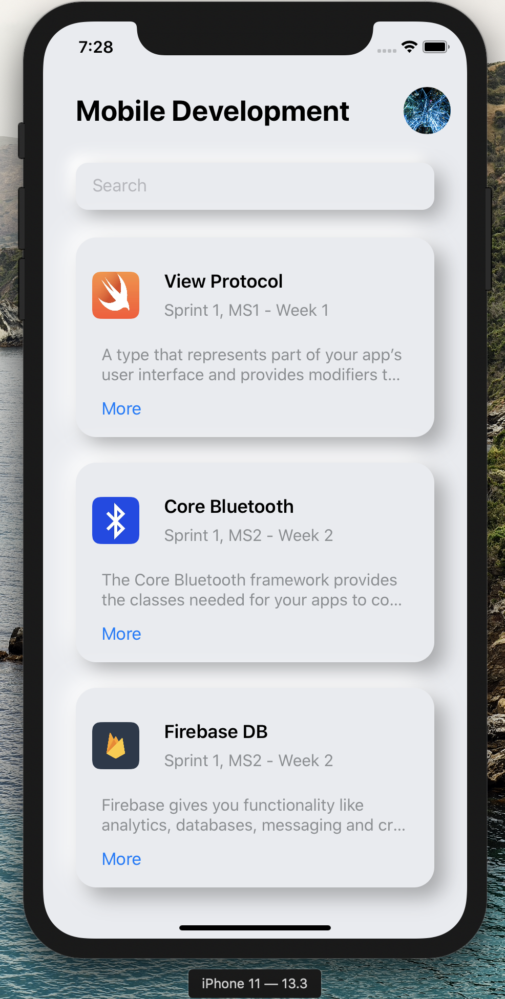

# SwiftUI 


[Cocoapods](https://cocoapods.org)


### Deployment

```ssh
$ git clone repo
$ cd repo
$ pod install
$ open -a Xcode Bluetooth.xcworkspace
``` 

<hr/>


### File directory

```ssh
.
├── Bluetooth.xcodeproj         # Original Project
├── Bluetooth.xcworkspace       # Project with Cocoapods dependencies 
│
├── Podfile                     # Cocoapods dependencies
│
└── Bluetooth
    ├── Utils
    |   └── ...
    ├── Views
    |   └── ...
    ├── Models
    |   └── ...
    ├── Logic
    |   └── ...
    ├── AppDelegate.swift           # Entry point - Firebase Init
    ├── SceneDelegate.swift         # Defines the Root View
    ├── ContentView.swift           # Root View
    ├── Info.plist                  # XMI App - Hardware Specs
    └── GoogleService-Info.plist    # Firebase Key

    
``` 

<hr/>


### Preview



